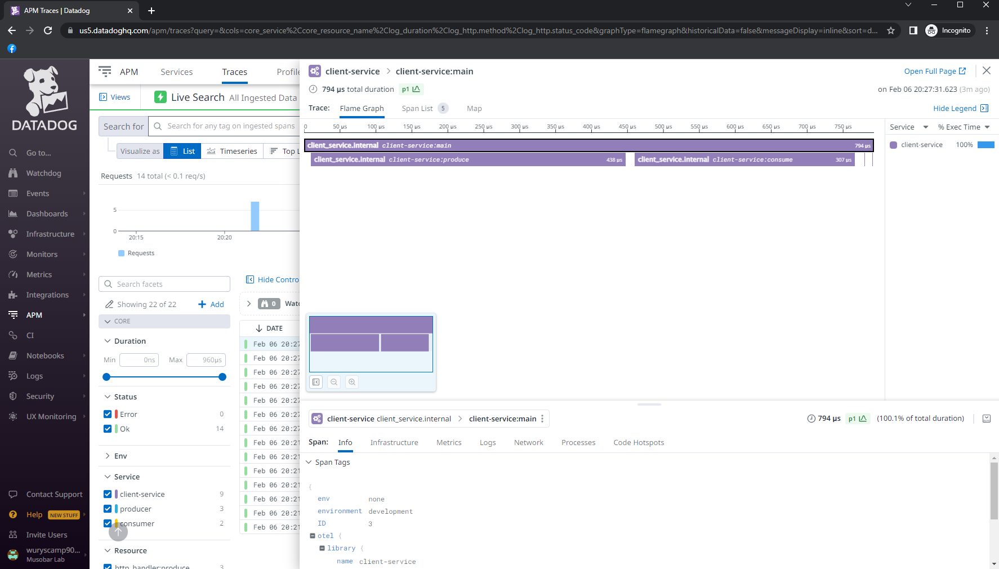
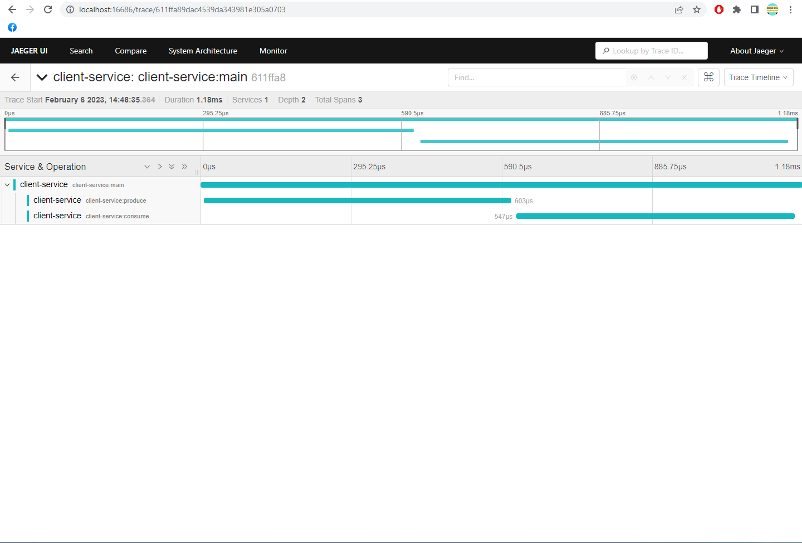
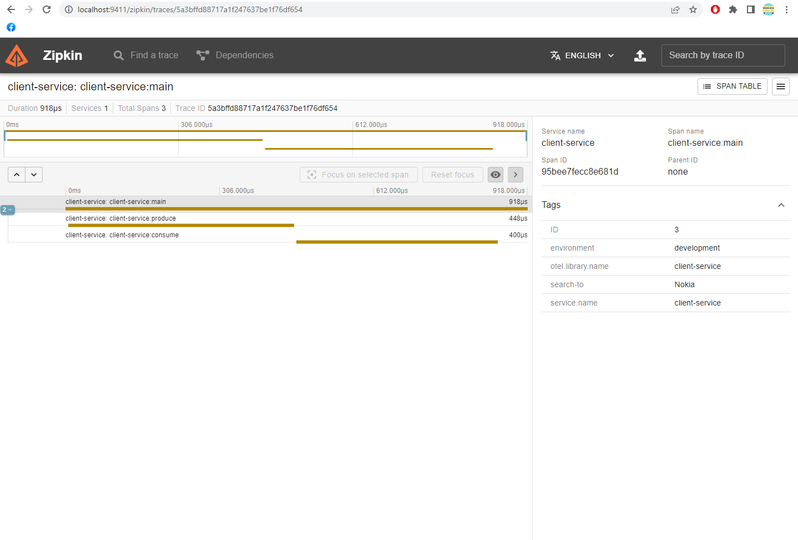
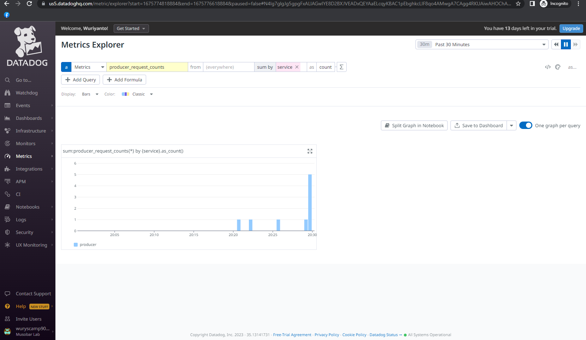
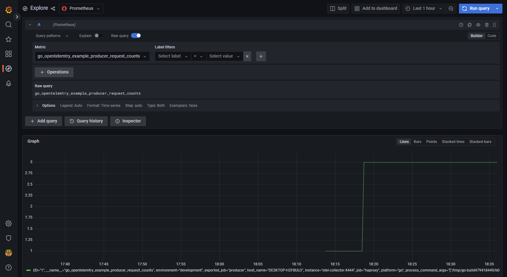

### Golang OpenTelemetry example with Datadog, Zipkins and Jaeger

Start Jaeger, Zipkin and OTEL Collector
```shell
$ docker-compose up
```

Start `serviceone`
```shell
$ cd serviceone/
$ go run main.go
```

Start `servicetwo`
```shell
$ cd servicetwo/
$ go run main.go
```

Run `client`
```shell
$ cd client/
$ go run main.go Samsung
```

### TODO
- Add Metrics

#### Datadog span

[](https://github.com/musobarlab)
<br/><br/>

#### Jaeger span

[](https://github.com/musobarlab)
<br/><br/>

#### Zipkin span

[](https://github.com/musobarlab)
<br/><br/>

#### Datadog metric

[](https://github.com/musobarlab)
<br/><br/>

#### Grafana metric

[](https://github.com/musobarlab)
<br/><br/>

### Errors
- Docker Compose error: `prometheus docker /prometheus/queries.active: permission denied`

Set permission to `Prometheus volume and Grafana volume`
```shell
$ id -u
$ 1000
$ sudo chown -R 1000:1000 volumes/prometheus/data/
$ sudo chown -R 1000:1000 volumes/grafana/data/
```